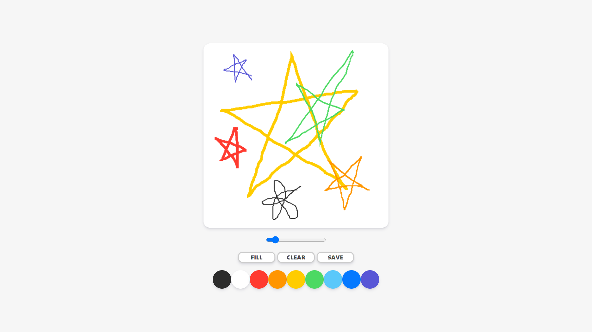
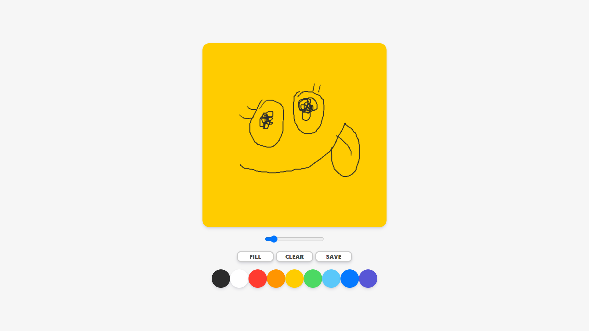
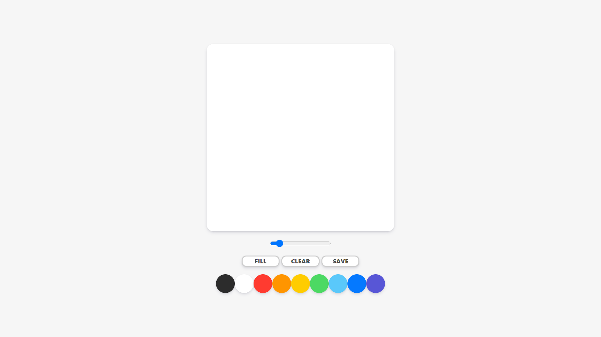
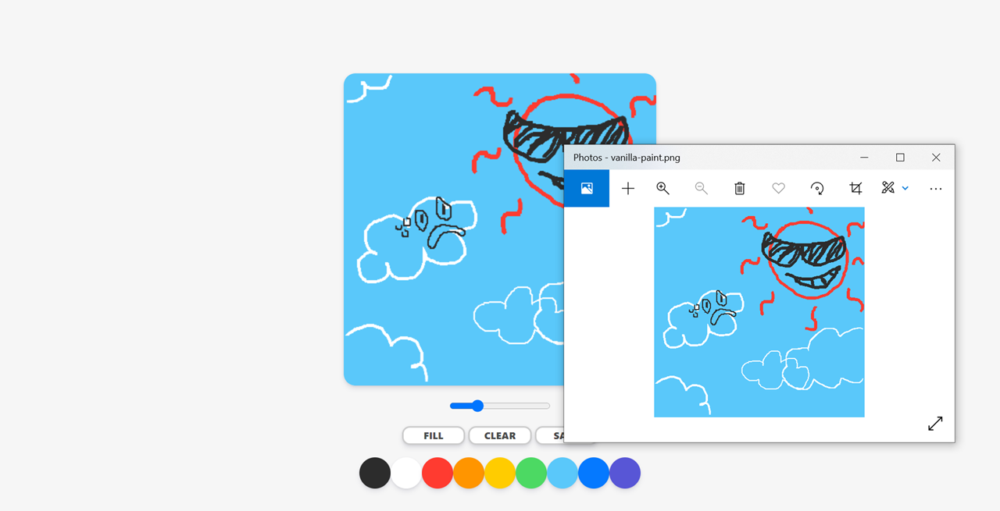

# [Vanilla Paint](https://vanilla-paint.netlify.app)

Vanilla Paint is a paint app made with HTML, CSS, and Vanilla JS. Hence, its name is "Vanilla" Paint.

## Features

### Drawing

### Filling and clearing canvas

### Saving work

